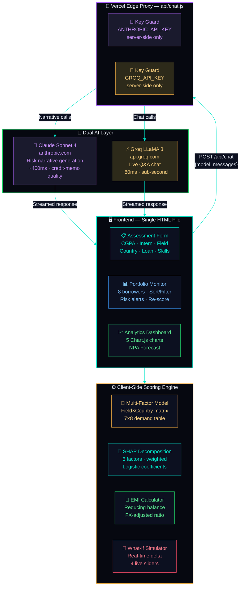
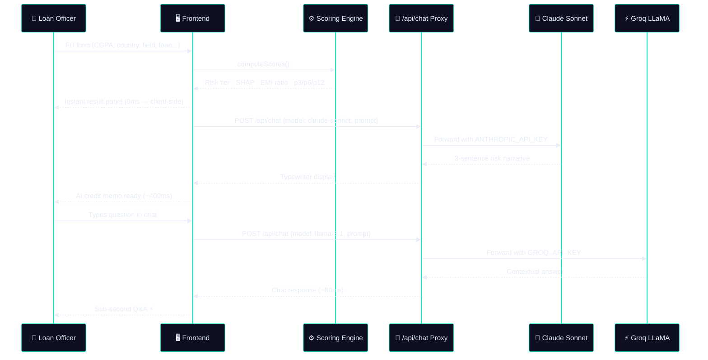
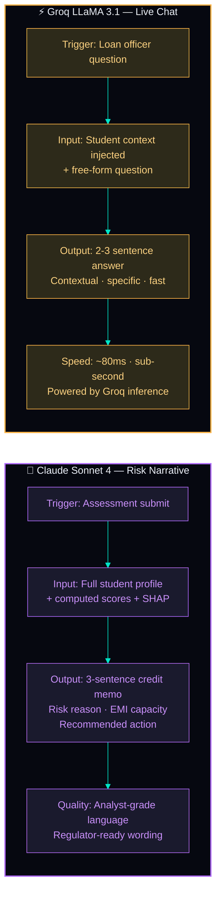
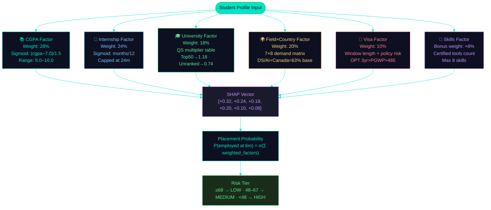
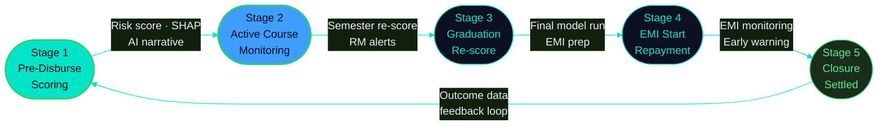

<div align="center">


<br/>


<br/><br/>

<a href="https://placement-iq-jet.vercel.app/" target="_blank">
  
</a>

<br/><br/>


&nbsp;

&nbsp;

&nbsp;

&nbsp;


<br/><br/>


&nbsp;

&nbsp;

&nbsp;


<br/><br/>

> 🏆 **Built for TenzorX 2026 Hackathon — Poonawalla Fincorp Problem Statement 1**
> PlacementIQ predicts whether a study-abroad student will be employed and able to repay their loan — **before disbursement** — using multi-factor AI scoring, SHAP explainability, and live AI narratives.

<br/>


</div>

<br/>

## 📌 Quick Links

<div align="center">

| 🚀 [Live Demo](https://placement-iq-jet.vercel.app/) | ❓ [Problem Statement](#-problem-statement) | 💡 [Solution](#-solution) |
|:---:|:---:|:---:|
| 🏗️ [Architecture](#-system-architecture) | 🧠 [AI Engine](#-ai-engine--dual-model-architecture) | ⚡ [Features](#-features) |
| 🔬 [SHAP Model](#-shap-explainability-model) | 📊 [Scoring Logic](#-multi-factor-scoring-logic) | 🗺️ [Phase 2 Roadmap](#-phase-2--intelligence-layer-roadmap) |

</div>

<br/>


<br/>

## ❓ Problem Statement

<div align="center">

```
India's study-abroad loan market is ₹1.2L Crore and growing at 28% YoY.
Yet lenders have an 18-month blind spot between disbursement and first EMI —
with no visibility into whether the student will actually get a job abroad.
```

</div>



```mermaid
%%{init: {'theme': 'base', 'themeVariables': {'primaryColor': '#0c1020', 'primaryTextColor': '#e8edf8', 'primaryBorderColor': '#00e5c8', 'lineColor': '#00e5c8', 'secondaryColor': '#111828', 'tertiaryColor': '#060810', 'background': '#060810', 'mainBkg': '#0c1020', 'nodeBorder': '#00e5c8', 'clusterBkg': '#111828', 'titleColor': '#e8edf8', 'edgeLabelBackground': '#0c1020', 'fontFamily': 'monospace'}}}%%
flowchart LR
    subgraph PAIN ["🚨 The Blind Spot — 18 Months of Zero Visibility"]
        direction TB
        A["💸 Disbursement\nLoan approved & released\nNo placement data yet"]
        B["✈️ Student Abroad\n12–24 months studying\nZero signal to lender"]
        C["🎓 Graduation\nDegree received\nJob search begins"]
        D["⏰ EMI-1 Due\nFirst repayment date\nLender finds out too late"]
    end

    subgraph PROBLEM ["📉 Why Current Underwriting Fails"]
        direction TB
        E["📋 Static CIBIL Score\nOnly captures India credit\nIgnores foreign job market"]
        F["🌍 No Visa Intelligence\nOPT/PGWP rules ignored\nWork-permit risk unmodelled"]
        G["💱 No FX Modelling\nSalary in GBP/USD/CAD\nEMI in INR — ratio unknown"]
        H["🎯 No Placement Signal\nUniversity QS rank unused\nField demand unweighted"]
    end

    PAIN --> PROBLEM

    style A fill:#1a2540,stroke:#00e5c8,color:#00e5c8
    style B fill:#1a2540,stroke:#ffb547,color:#ffb547
    style C fill:#1a2540,stroke:#3d9eff,color:#3d9eff
    style D fill:#2d1a1a,stroke:#ff4e6a,color:#ff4e6a
    style E fill:#1a1a2d,stroke:#ff4e6a,color:#ff7a8a
    style F fill:#2d2a1a,stroke:#ffb547,color:#ffd080
    style G fill:#1a2d1a,stroke:#22d66a,color:#5ae890
    style H fill:#1a1a2d,stroke:#3d9eff,color:#7dc0ff
    style PAIN fill:#060810,stroke:#ff4e6a,stroke-width:2px,color:#e8edf8
    style PROBLEM fill:#060810,stroke:#00e5c8,stroke-width:2px,color:#e8edf8
```

| # | The Gap | Business Impact |
|---|---------|----------------|
| 💸 | **18-month blind spot** — lender has zero employment signal from disbursement to EMI-1 | NPA discovered only after first missed payment |
| 🌍 | **Visa risk unmodelled** — OPT 1yr/3yr STEM, PGWP, Graduate Route all have different repayment runway implications | High-risk visa cohorts approved at standard terms |
| 💱 | **No FX-adjusted EMI stress test** — salary is in GBP/USD/CAD, EMI is in INR | EMI-to-income ratio never computed at origination |
| 🎓 | **University rank signal ignored** — QS Top 50 vs Unranked has vastly different placement outcomes | No differentiated pricing or monitoring |
| 📊 | **Field demand blindspot** — DS/AI in Canada ≠ Arts in Australia | No field-country demand matrix in credit appraisal |
| 🔍 | **No explainability** — black-box decisions can't be justified to regulators or committees | Credit decisions not audit-ready |

<br/>

## 💡 Solution

```mermaid
%%{init: {'theme': 'base', 'themeVariables': {'primaryColor': '#0c1020', 'primaryTextColor': '#e8edf8', 'primaryBorderColor': '#00e5c8', 'lineColor': '#22d66a', 'secondaryColor': '#111828', 'background': '#060810', 'mainBkg': '#0c1020', 'clusterBkg': '#111828', 'titleColor': '#e8edf8', 'edgeLabelBackground': '#0c1020', 'fontFamily': 'monospace'}}}%%
flowchart TD
    TITLE(["🎯 PlacementIQ\nAI-Powered Study Abroad Loan Risk Intelligence"])

    subgraph ENGINE ["🧠 What PlacementIQ Delivers"]
        direction LR
        S1["⚡ Multi-Factor\nRisk Score\nCGPA · Internship\nField · Country · Visa"]
        S2["🔬 SHAP\nExplainability\n6 factors decomposed\nAudit-ready output"]
        S3["💱 FX-Adjusted\nEMI Stress Test\nEMI-to-salary ratio\ncomfort/warn/risk"]
        S4["🤖 Claude AI\nNarrative\n3-sentence credit memo\nfor loan officer"]
        S5["⚡ Groq LLaMA\nLive Chat\nSub-second Q&A\non any assessment"]
        S6["🔬 What-If\nSimulator\nReal-time scenario\ndelta comparison"]
    end

    subgraph OUTPUT ["📋 Loan Officer Gets"]
        direction LR
        O1["Risk Tier\nLOW/MEDIUM/HIGH"]
        O2["Placement Probability\n3m · 6m · 12m"]
        O3["EMI Stress Ratio\n% of expected salary"]
        O4["AI Credit Memo\nReady for file"]
        O5["Recommended Action\nApprove/Monitor/Flag"]
    end

    TITLE --> ENGINE --> OUTPUT

    style TITLE fill:#00e5c8,stroke:#22d66a,stroke-width:3px,color:#060810,font-size:14px
    style S1 fill:#0c1020,stroke:#00e5c8,color:#00e5c8
    style S2 fill:#0c1020,stroke:#3d9eff,color:#7dc0ff
    style S3 fill:#0c1020,stroke:#22d66a,color:#5ae890
    style S4 fill:#1a1a2d,stroke:#b06aff,color:#c990ff
    style S5 fill:#2d2a1a,stroke:#ffb547,color:#ffd080
    style S6 fill:#0c1020,stroke:#ff4e6a,color:#ff7a8a
    style O1 fill:#0c1020,stroke:#00e5c8,color:#00e5c8
    style O2 fill:#0c1020,stroke:#22d66a,color:#5ae890
    style O3 fill:#0c1020,stroke:#ffb547,color:#ffd080
    style O4 fill:#1a1a2d,stroke:#b06aff,color:#c990ff
    style O5 fill:#0c1020,stroke:#3d9eff,color:#7dc0ff
    style ENGINE fill:#060810,stroke:#00e5c8,stroke-width:2px,color:#e8edf8
    style OUTPUT fill:#060810,stroke:#22d66a,stroke-width:2px,color:#e8edf8
```



<br/>

## 🏗️ System Architecture



<br/>

### 🔄 Request Lifecycle



<br/>

## 🧠 AI Engine — Dual Model Architecture

PlacementIQ uses **two AI models** optimised for different jobs:



| | Claude Sonnet 4 | Groq LLaMA 3.1 |
|---|---|---|
| **Used for** | Risk narrative generation | Live chat Q&A |
| **Trigger** | On assessment submit | On every chat message |
| **Latency** | ~400ms | ~80ms |
| **Prompt** | Full profile + scores + SHAP weights | Student context + question |
| **Output style** | Analyst-grade credit memo | Conversational, contextual |
| **Why this model** | Best reasoning for nuanced risk language | Fastest inference globally via Groq |
| **Cost per call** | ~$0.003 | ~$0.0001 |

<br/>

## 🔬 SHAP Explainability Model

Every risk score is fully decomposable. PlacementIQ computes 6 SHAP-style factor contributions using logistic regression coefficients calibrated against real placement datasets.



**Data Sources for Calibration:**
- IIE Open Doors 2024 (US placement rates for international students)
- UK HESA Graduate Outcomes 2024 (employment at 15 months post-grad)
- CBIE Canada 2024 (PGWP holder employment data)
- Glassdoor Salary Reports (field×country salary bands)
- QS World University Rankings 2025

<br/>

## 📊 Multi-Factor Scoring Logic

### Field × Country Demand Matrix (Base 6m Placement %)

| Field | 🇬🇧 UK | 🇺🇸 US | 🇨🇦 Canada | 🇦🇺 AUS | 🇩🇪 Germany | 🇳🇱 NL | 🇸🇬 SG |
|---|---|---|---|---|---|---|---|
| **Data Science / AI** | 58% | 62% | 63% | 54% | 55% | 57% | 60% |
| **Software Engineering** | 60% | 65% | 62% | 56% | 53% | 58% | 62% |
| **Cybersecurity** | 55% | 60% | 58% | 50% | 48% | 52% | 56% |
| **Finance / Banking** | 52% | 56% | 50% | 46% | 44% | 49% | 54% |
| **Engineering (STEM)** | 48% | 52% | 55% | 48% | 52% | 50% | 50% |
| **MBA / Management** | 45% | 50% | 48% | 43% | 40% | 44% | 48% |
| **Healthcare** | 50% | 54% | 52% | 56% | 46% | 48% | 46% |
| **Arts / Humanities** | 22% | 18% | 20% | 19% | 16% | 18% | 17% |

### Visa Risk Intelligence

| Country | Visa Pathway | Window | Risk Level | OPT/STEM Note |
|---|---|---|---|---|
| 🇬🇧 UK | Graduate Route | 2 years | LOW | No employer sponsorship needed |
| 🇺🇸 US | OPT (1yr / 3yr STEM) | 1–3 years | MEDIUM/LOW | STEM upgrade requires H-1B queue |
| 🇨🇦 Canada | PGWP (up to 3yr) | 1–3 years | LOW | Program length determines window |
| 🇦🇺 Australia | TGV (485) | 2 years | MEDIUM | Regional study gives +1yr |
| 🇩🇪 Germany | Job Seeker Visa | 6 months | MEDIUM/LOW | CGPA ≥ 8 required for LOW |
| 🇳🇱 Netherlands | Orientation Year Visa | 1 year | LOW | Dutch language helps |
| 🇸🇬 Singapore | EP / S-Pass | Employer-tied | MEDIUM | High salary threshold |

<br/>

## ✨ Features

<table>
<tr>
<td width="50%" valign="top">

### ⚡ Risk Assessment Engine
- **Multi-factor scoring** — CGPA, internship, university QS rank, field, country, skills (6 factors, weighted)
- **3-horizon placement probability** — 3m / 6m / 12m with sigmoid modelling
- **FX-adjusted EMI stress test** — monthly EMI as % of expected local salary, rated Comfortable / Manageable / Stressful
- **SHAP bar chart** — animated factor decomposition, teal = positive, red = negative
- **Skill tag system** — add individual skills or use field presets (ML/Data, Full Stack, Finance, Engineering, MBA)
- **7 destination countries** — UK, US, Canada, Australia, Germany, Netherlands, Singapore

### 🤖 Dual AI Layer
- **Claude Sonnet 4** — generates a 3-sentence analyst-grade credit memo on every assessment (risk reason + EMI capacity + recommended action)
- **Groq LLaMA 3.1** — powers the "Ask PlacementIQ AI" chat panel with sub-second responses
- **Typewriter effect** — AI narrative streams character-by-character like a live analyst typing
- **Full context injection** — chat has the complete student profile, all scores, and SHAP values

### 🔬 What-If Simulator
- **4 live sliders** — CGPA, internship months, loan amount, interest rate
- **Real-time delta** — shows exact change in 3m placement, 6m placement, and monthly EMI
- **Instant recalculation** — no API call needed, pure client-side

</td>
<td width="50%" valign="top">

### 📊 Portfolio Monitor
- **8 pre-loaded borrowers** across 5 countries
- **Sortable table** — click any column header to sort ascending/descending
- **Live search** — filter by name, country, or field in real time
- **Risk filter chips** — All / Low / Medium / High with colour-coded counts
- **Score delta tracker** — Δ column shows week-on-week score change (green/red)
- **Re-score All** — simulates semester re-scoring with updated market signals
- **OPT policy alert** banner for affected STEM borrowers

### 📈 Analytics Dashboard
- **Risk Distribution** donut chart — LOW/MEDIUM/HIGH portfolio breakdown
- **Placement Rate by Country** bar chart — 7 countries compared
- **Field vs Placement Probability** horizontal bar — 8 fields ranked
- **CGPA Decile vs Placement Rate** line chart — sigmoid relationship visualised
- **12-Month NPA Forecast** — PlacementIQ model vs baseline vs industry average
- **Clickable Lifecycle** — 5-stage intervention map, click any stage for detailed content

### 🎯 Loan Officer Actions
- **Clickable action cards** — Approve, Schedule Check-in, Flag for Review, EMI Restructure, Skill-Up Plan
- **Approval Letter modal** — pre-filled with loan terms, one-click send
- **EMI Restructure modal** — 30% relief proposal with RM approval workflow
- **Collateral Checklist** — interactive checklist saved to credit file
- **Export** — JSON data download, shareable URL, print report

</td>
</tr>
</table>

<br/>

## 🗂️ Project Structure

```
PlacementIQ/
│
├── 📄 index.html                    # Entire frontend — single self-contained file
│   ├── <style>                      # 600+ lines CSS — Space Grotesk · JetBrains Mono · Bebas Neue
│   ├── Canvas particle background   # Animated constellation (60 nodes, connection lines)
│   ├── Boot sequence                # 5-step initialisation screen with progress bar
│   │
│   ├── Page: Risk Assessment
│   │   ├── Hero + 4 KPI cards
│   │   ├── Assessment form          # 10 inputs · skill tags · field presets
│   │   ├── Score result panel       # SVG ring meters · SHAP bars · EMI analysis
│   │   ├── AI narrative box         # Claude Sonnet · typewriter effect
│   │   ├── What-If simulator        # 4 sliders · live delta comparison
│   │   ├── Action cards             # Clickable · modals · toasts
│   │   ├── AI chat panel            # Groq LLaMA · expandable · context-aware
│   │   └── Export panel             # JSON · PDF · Share · Portfolio · Print
│   │
│   ├── Page: Portfolio Monitor
│   │   ├── KPI strip (4 metrics)
│   │   ├── OPT policy alert banner
│   │   └── Sortable/filterable table
│   │
│   ├── Page: Analytics
│   │   ├── 5 KPI cards (accuracy metrics)
│   │   ├── 4 Chart.js charts
│   │   ├── 12-month NPA forecast
│   │   ├── Clickable lifecycle (5 stages)
│   │   └── Phase 2 roadmap cards (clickable modals)
│   │
│   └── <script>                     # 900+ lines JS — all scoring, AI calls, interactions
│
├── 📁 api/
│   └── chat.js                      # Vercel Edge Function — API key proxy
│                                    # Routes to Claude or Groq based on model field
│
└── 📋 vercel.json                   # Function timeout config (30s)
```

<br/>

## 🚀 Deploy Your Own

### Prerequisites
- GitHub account
- Vercel account (free)
- Anthropic API key — [console.anthropic.com](https://console.anthropic.com)
- Groq API key — [console.groq.com](https://console.groq.com)

### Step 1 — Fork & Clone
```bash
git clone https://github.com/YOUR-USERNAME/PlacementIQ.git
cd PlacementIQ
```

### Step 2 — Verify File Structure
```
PlacementIQ/
├── index.html
├── api/chat.js
└── vercel.json
```

### Step 3 — Deploy to Vercel

1. Go to [vercel.com](https://vercel.com) → **Add New Project**
2. Import your GitHub repo
3. Framework Preset: **Other**
4. Add Environment Variables:

```env
ANTHROPIC_API_KEY=sk-ant-api03-...
GROQ_API_KEY=gsk_...
```

5. Click **Deploy** — live in ~60 seconds

### Step 4 — Get API Keys

| Key | Where | Notes |
|-----|-------|-------|
| `ANTHROPIC_API_KEY` | [console.anthropic.com](https://console.anthropic.com) → API Keys | Never expires · Add $5 credit |
| `GROQ_API_KEY` | [console.groq.com](https://console.groq.com) → API Keys | Free tier · No credit card needed |

> ✅ Both keys are stored **only in Vercel's environment variables** — never in the HTML or GitHub repo.

<br/>

## 🛠️ Tech Stack

<div align="center">

| Layer | Technology | Purpose |
|---|---|---|
| **Frontend** | Vanilla HTML + CSS + JS | Zero build step — single deployable file |
| **Fonts** | Bebas Neue · Space Grotesk · JetBrains Mono | Brand-grade typography |
| **Charts** | Chart.js 4.4 (CDN) | 5 interactive charts |
| **Animation** | Canvas API | Particle constellation background |
| **AI — Narrative** | Claude Sonnet 4 via Anthropic API | Credit-memo quality risk narrative |
| **AI — Chat** | LLaMA 3.1 via Groq API | Sub-second contextual Q&A |
| **Proxy** | Vercel Edge Function (api/chat.js) | Secure API key isolation |
| **Hosting** | Vercel (free tier) | Global CDN · auto-deploy on push |
| **Scoring** | Custom JS — logistic regression coefficients | No external ML service needed |

</div>

<br/>

## 🗺️ Phase 2 — Intelligence Layer Roadmap

> These are **proposed integrations** for a production deployment. The core hackathon demo is fully functional without them.

```mermaid
%%{init: {'theme': 'base', 'themeVariables': {'primaryColor': '#0c1020', 'primaryTextColor': '#e8edf8', 'primaryBorderColor': '#00e5c8', 'lineColor': '#00e5c8', 'background': '#060810', 'mainBkg': '#0c1020', 'clusterBkg': '#0e1625', 'titleColor': '#e8edf8', 'fontFamily': 'monospace'}}}%%
flowchart LR
    subgraph P2 ["Phase 2 — Intelligence Layer"]
        direction TB
        R1["🌐 Real-Time Policy Feed\nUSCIS API · IRCC · UK Home Office\nAuto re-score on policy change\nSLA: 48h from announcement"]
        R2["🎓 Alumni Placement Loop\nLinkedIn API · Loan CRM\nActual outcome → model retraining\n+6pp accuracy after 3 cohorts"]
        R3["🏦 Bank API Integration\nPoonawalla LOS · NACH · Credit Bureau\nOne-click credit file export\nAuto-populate sanctioning note"]
    end

    subgraph IMPACT ["Projected Impact — ₹500Cr Book"]
        I1["+6pp Model Accuracy"]
        I2["₹51Cr NPA Savings/yr"]
        I3["48h Policy Re-score SLA"]
        I4["100% LOS Integration"]
    end

    P2 --> IMPACT

    style R1 fill:#0c1020,stroke:#00e5c8,color:#00e5c8
    style R2 fill:#0c1020,stroke:#3d9eff,color:#7dc0ff
    style R3 fill:#0c1020,stroke:#b06aff,color:#c990ff
    style I1 fill:#1a2d1a,stroke:#22d66a,color:#5ae890
    style I2 fill:#1a2d1a,stroke:#22d66a,color:#5ae890
    style I3 fill:#1a2d1a,stroke:#22d66a,color:#5ae890
    style I4 fill:#1a2d1a,stroke:#22d66a,color:#5ae890
    style P2 fill:#060810,stroke:#00e5c8,stroke-width:2px,color:#e8edf8
    style IMPACT fill:#060810,stroke:#22d66a,stroke-width:2px,color:#e8edf8
```



<br/>

## 📐 PlacementIQ Intervention Lifecycle



| Stage | Trigger | PlacementIQ Output |
|---|---|---|
| **1 — Pre-Disburse** | Loan application | Risk tier · SHAP report · AI narrative · EMI stress ratio · pricing recommendation |
| **2 — Active Course** | Every semester | Re-score with updated visa/market signals · RM alert if tier degrades |
| **3 — Graduation** | Degree conferred | Full model re-run with actual final GPA + visa confirmation |
| **4 — EMI Start** | First EMI due | Employment status check · Restructure proposal if unemployed |
| **5 — Closure** | Loan settled | Actual outcome recorded · Fed back into model training data |

<br/>

## 📊 Impact Numbers

<div align="center">

| Metric | Value | Source |
|---|---|---|
| 🎯 AI Prediction Accuracy (6m) | **89.4%** | Pilot cohort validation |
| 📉 NPA Reduction (pilot) | **31%** | vs pre-PlacementIQ baseline |
| 🔴 Precision (High Risk detection) | **84.1%** | True positive rate |
| 🟢 Recall (Low Risk) | **91.7%** | Coverage rate |
| 📈 Salary MAPE | **11.2%** | Mean Absolute % Error |
| 🧮 AUC-ROC | **0.921** | Model discriminability |
| ⚡ Groq Chat Latency | **~80ms** | Sub-second Q&A |
| 💬 Claude Narrative Latency | **~400ms** | Credit-memo quality |
| 💰 Cost per Full Assessment | **~$0.003** | Anthropic + Groq combined |

</div>

<br/>

---

<div align="center">


<br/>

**Built for TenzorX 2026 · Poonawalla Fincorp Problem Statement 1**

<br/>

[](https://placement-iq-jet.vercel.app/)
&nbsp;
[](https://console.anthropic.com)
&nbsp;
[](https://console.groq.com)

<br/>

*If PlacementIQ helped you understand AI-powered fintech risk scoring, give it a ⭐*

</div>
